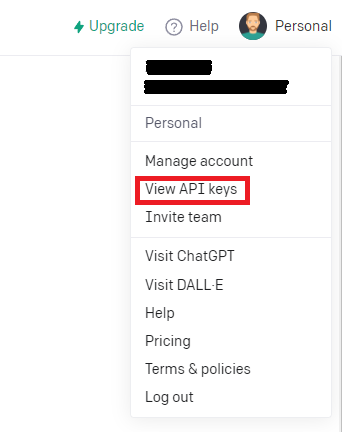
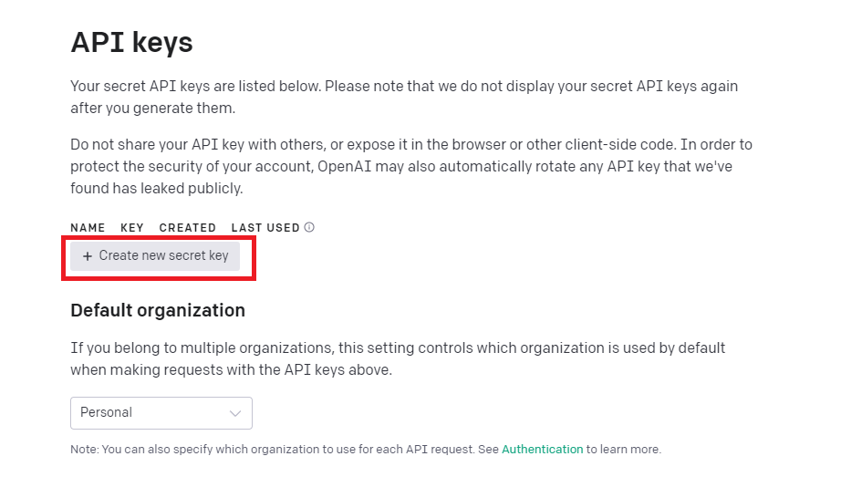
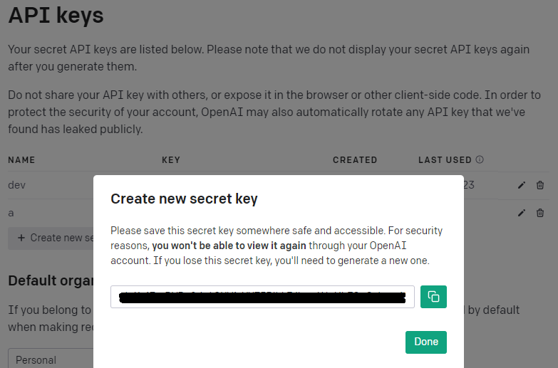
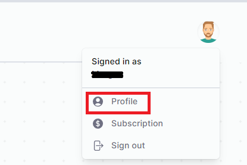
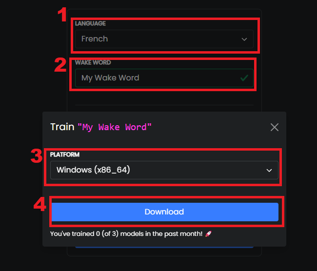

# ASSISTANT IA POUR STREAMER
### Pour du divertissement

@TODO CONTRIBUTORS :list 
- Screen des étapes
- Faire une installation avec un requirements.txt
- rendre plus efficace le code (réduire la latence)
- Rajouter du langhchain (si nécéssaire et testant la latence) pour modifier son LLM etc..
- Améliorer le README
- etc....
- 
## Configuration nécessaire

1. Exécutez `pip install -r requirements.txt` pour installer toutes les dépendances.

2. Remplissez le fichier `.env.example` avec vos clés API pour OPENAI, ELEVENLABS, et PICOVOICE. Renommez ce fichier en `.env`.

## Comment obtenir ces clés API

### Récupérer sa clé twitch

### Créez un compte sur OPENAI

1. Allez sur [OpenAI](https://www.openai.com/).
2. Inscrivez-vous pour un compte.
3. Une fois connecté, rendez-vous dans le [dashboard d'OpenAI](https://platform.openai.com/)

4. Cliquez sur votre profil -> View API Keys pour arriver sur [votre page d'API](https://platform.openai.com/account/api-keys)

5. `Create new secret key` puis donnez un nom à votre key. 

:warning: Une fois votre API Key créer, pensez à bien copier/enregistrer le secret, il ne vous seras plus possible de le récuperer ensuite.

### Créez un compte sur ELEVENLABS

1. Allez sur [ElevenLabs](https://beta.elevenlabs.io/).
2. Inscrivez-vous pour un compte.
3. Une fois connecté, vous trouverez votre clé API dans votre profil:

## Créez le mot clé (Wake Word) dans PICOVOICE

1. Allez sur [Picovoice Console](https://console.picovoice.ai/).
2. Créez un compte.
3. Récuperez votre API Key
4. Créez un nouveau mot clé (Wake Word) via [Porcupine](https://console.picovoice.ai/ppn) (cf SCapture d'écrans - étape 1 à 4)
5. Mettre les fichiers nécessaires (votre wake-word en .ppn ainsi que le model pour votre lange en .pv [disponible ici](https://github.com/Picovoice/porcupine/tree/master/lib/common)) dans votre projet.

## Comment générer les voix d'introduction sur Eleven

1. Connectez-vous à votre compte ElevenLabs.
2. Utilisez la [fonctionnalité de génération de voix](https://elevenlabs.io/speech-synthesis) pour créer des voix d'introduction personnalisées.
3. Téléchargez ces audio mp3 et ajoutez-les manuellement à votre dossier 'voix_intro'.

## Annexes

### Debian 11

Pour **pyaudio** il est nécessaire d'installer les paquets suivants:

* sudo apt-get install libasound-dev portaudio19-dev libportaudio2 libportaudiocpp0
